# 在 starry 中使用控制器的改造方案

## 历史版本
1. [第一版](https://github.com/ATS-INTC/moic/blob/5609c8e8a35b7096c7ac53368690cef8390c8e6a/starry-renovation.md)
2. [第二版](https://github.com/ATS-INTC/moic/blob/191372a3ae6d390ed1e03cb070852df77320a16f/starry-renovation.md)

[toc]

## 任务组织结构

整个系统的任务组织形式为一个树状结构。



蓝色表示管理任务，不代表执行流，它们负责资源管理、以及子任务管理，包括 hypervisor、os、process。

灰色表示执行流任务，在每个管理任务下都存在者各自的执行流，指 thread、coroutine。

## 上下文切换（跳板页的设计）

### 任务上下文数据结构

#### 目标：

将协程上下文、线程上下文、trap 上下文整合到一个数据结构中。

#### 现状

1. 没有考虑协程上下文
2. trap 上下文与线程上下文分别表示

#### 上下文结构对比

1. 协程上下文：在操作系统的角度看，协程没有明确指出使用了哪个寄存器，编译器决定了要保存了恢复的寄存器，并将跨越 await 的变量保存在堆上。因此，在上下文中需要维护的信息可能是只有 8 字节的 core::task::Context 变量（实际是指向自己的指针）。这个变量在协程运行时才会使用，并且可以临时构造，因此无需保存在上下文中。

2. 线程上下文：函数调用关系保存在栈上，当前的栈不能被复用。因此相比协程，其主要保存的是额外的栈指针。

3. trap 上下文：根据 trap 前的特权级不同，需要保存的 trap 上下文不同，区别主要在与特权级相关的寄存器上。与线程上下文相比，trap 上下文保存了剩余的通用寄存器和额外的特权级寄存器。

#### 思路与设计

在同一个地址空间中，在协程的实现中，编译器把跨越 await 的变量保存在堆上，并且将函数调用关系转化为为状态机，因此栈能被复用；主动进行的线程切换，看似只保存了 ra、sp、s0 ~ s11 这些寄存器，但实际的函数调用关系都保存在栈上，这个栈不能被复用；而一旦产生了被动的切换（中断、异常），在主动的线程切换的基础上，还需要保存其他的额外的通用寄存器（gp、tp、t0 ~ t6、a0 ~ a7）。因此，**所有的通用寄存器构成了同一个地址空间中的基本的执行流上下文。**

基本的执行流足以应付同一地址空间中的任务切换，而当切换需要涉及特权级时，基本执行流保存的信息是否足够呢？例如从内核切换到用户态， 这里有两种思路：

1. 将这种执行流的切换，视为是上一个内核的普通执行流切换到下一个处于用户态的执行流；
2. 用户态执行流在内核态存在对应的内核执行流，从对应的内核执行流切换到用户态执行流；

在目前大多数的系统实现中，采用的是第二种，用户态线程对应着一个内核线程，从一个内核线程切换到用户线程，需要先切换到用户线程对应的内核线程，再切换到用户线程。**这种实现将线程上下文与 trap 上下文分割开来。** 需要保留空闲的内核线程栈，供进入内核时使用。**当执行用户线程时，对应的内核栈是空的，当进入到内核时，如果用户线程对应的在内核中的执行没有阻塞时，这个内核栈实际上是能够复用的。** 而用户线程对应的内核执行流如果阻塞了，传统的线程实现，则需要将函数调用关系保存在栈上，因此保留空闲的内核栈是必要的。

但协程出现后，在内核中的执行流即使阻塞了，编译器也会将信息保存在堆上，从而可以重复使用同一个栈。因此，==**使用协程后，不需要为用户态的执行流额外维护对应的内核栈，从而可以将线程上下文（栈）和 trap 上下文统一。无论执行流处于什么特权级或地址空间中，都只需要保存一个基本的执行流上下文，附加一些额外的特权级信息即可。**==

以用户执行流发生中断陷入内核为例，需要做的事情为：

1. 将原本的基本执行流的寄存器现场保存起来
2. 切换到新的栈上
3. 运行调度器，取出中断处理任务

这种方式只需要保存被打断的执行流上下文即可。

#### 实现

```rust
#[repr(C)]
#[derive(Debug)]
pub struct TaskContext {
    pub x: [usize; 31],
    pub addrspace_token: usize,
    pub free_sp: usize,
    pub schedule_fn: usize,
    pub priv_info: PrivInfo,
}

#[repr(C)]
#[derive(Debug)]
pub enum PrivInfo {
    SPrivilige(SPrivilige),
    UPrivilige(UPrivilige),
    UnKnown
}

#[repr(C)]
#[derive(Debug)]
pub struct SPrivilige {
    pub sstatus: usize,
    pub sepc: usize,
    pub stvec: usize,
    pub sie: usize,
}

#[repr(C)]
#[derive(Debug)]
pub struct UPrivilige {
    pub ustatus: usize,
    pub uepc: usize,
    pub utvec: usize,
    pub uie: usize,
}
```

### 跳板页

#### 目标

统一切换的入口

#### 现状

跳板页只是用户态陷入内核的入口

#### 思路与设计

根据是否切换特权级与地址空间，切换可以分为多种类别，不同类别的切换，出入口不同：


1. 黑色箭头路径：同一个地址空间中的任务主动切换（协程 --> 协程/线程）、同特权级中断（线程 --> 协程/线程）
2. 红色箭头路径：高特权级地址空间主动切换到低特权级空间（协程 --> 不同地址空间的协程/线程）
3. 蓝色箭头路径：低特权级进入高特权级（系统调用（协程 --> 内核中的协程/线程）、跨特权级中断（线程 --> 高特权级地址空间中的协程/线程）、异常（线程 --> 高特权级地址空间中的协程/线程））

主动进入跳板页后，上一个任务是协程，因此上一个任务的上下文由编译器帮助进行了保存，无需在跳板页中手动保存。因此直接进入到调度函数，从中取出下一个任务。

若被动进入跳板页，则上一个任务视为线程，此时需要保存上下文。整体流程如下所述（见上图右侧部分）：

1. **先将上下文保存在栈上，将寄存器空出来供后续使用。** 
2. 将上下文指针与当前的任务控制块关联起来
3. 取出新的栈，运行调度函数，取出下一个任务
4. 更新 percpu 段中的当前任务控制块信息，恢复下一个任务的上下文信息

## 异步系统调用和异步 IPC 的处理流程

### 异步系统调用


### 异步 IPC


