# 在 starry 中使用控制器的改造方案

### 20240627向勇的修改意见

1. starry的内核线程实现不应成为约束你的设计的前提，还是要以最大限度体现你的软硬协同特征来进行设计。即：实施在中断控制器设计的通过vDSO和中断控制器整合用户态和内核态的线程和协程的任务模型。
2. 在目前的中断控制器设计中，控制器应该是维护所有任务状态的主体，内存只是缓存的角色。
3. OS、进程、线程和协程的上下文切换流程，特别是跳板页的结构需要在设计中描述出来。
4. 异步系统调用和IPC的处理流程需要地设计中比较完整地描述出来。

## 调度模块

1. 将调度模块实现为共享库
2. 重新定义 axtask 模块中的 AxTaskRef，使其能够兼容线程/协程。（这一步是对 starry 进行异步改造，保证可以使用不同方式实现的 Executor）
3. 利用调度模块提供的接口修改 axtask 模块中的 api、processor、schedule 中的实现，使用基于控制器的调度
4. 验证在 unikernel 环境下能否正常工作
5. 重新定义 axprocess 模块中的 Process，与控制器进行兼容。
6. 验证在 monolithic 环境下能否正常工作

## 上下文切换（跳板页的设计）

根据是否切换特权级与地址空间，切换可以分为多种类别，不同类别的切换，出入口不同：

1. 黑色箭头路径：同一个地址空间中的任务主动切换（协程 --> 协程/线程）、同特权级中断（线程 --> 协程/线程）
2. 红色箭头路径：高特权级地址空间主动切换到低特权级空间（协程 --> 不同地址空间的协程/线程）
3. 蓝色箭头路径：系统调用（协程 --> 内核中的协程/线程）、跨特权级中断（线程 --> 高特权级地址空间中的协程/线程）、异常（线程 --> 高特权级地址空间中的协程/线程）

若切换为主动进行，则上一个任务是协程，下一个任务可能为线程或协程。
若切换为被动进行，则上一个任务是线程，下一个任务可能为线程或协程。

## 异步系统调用和异步 IPC 的处理流程

### 异步系统调用

### 异步 IPC

------------------------------------------------

## 控制块概念

hypervisor、OS、进程、线程、协程、设备等概念都对应于一个控制块，这是这些概念的共同点。

不同点：不同的概念充当的角色不一样。

- hypervisor、OS、进程：三个概念与隔离相关，具体表现为所处的地址空间以及特权级不同。
- 而线程/协程则表示 hypervisor/OS/进程内的执行流。

## 需要改造的模块

- [x] 调度框架
- [x] IPC 模块
- [ ] 设备管理

## 调度框架改造

### 核心观点：基于任务（执行流）标识的切换

- 纯软件的实现：LX 的工作，需要在 星光2 板子上运行
- 软硬件协同的实现：ZFL 的工作，基于已改造完成的 QEMU

### 功能

- 就绪队列的入队出队
  - 控制器中的等待任务都是与设备和 IPC 相关的，实际上是中断处理任务，这些等待队列与 starry 中的其他等待队列是兼容的，可以并存。因此，关于调度框架的修改不需要对其他的等待队列进行修改。
- 上下文切换
  - 狭义的上下文指的是执行流对应的寄存器信息，这部分不需要进行修改；但广义上的上下文还包括当前运行的线程/协程、进程、OS 等信息，需要针对这部分进行修改。

### 修改

因为控制器需要根据任务标识，在地址空间切换时与内存进行交互。而在控制器的驱动中，限制了由 TaskMeta 数据结构来生成对应的 TaskId（任务标识）。因此，首先需要解决的问题为如何根据 Process 和 AxTaskRef 来构造 TaskMeta，并转化成 TaskId？

由于 starry 中的用户态线程为内核支持的线程（AxTaskRef），且内核调度的对象是线程，整个系统的执行流为这些内核线程。因此改造只需要构造 OS 控制块，并且根据 AxTaskRef 来构造 TaskMeta 从而生成 TaskId，即可完成调度模块的改造。（针对 Process 的标识，也可直接沿用控制器驱动中定义好的 TaskMeta 来构造属于进程的 TaskId。如果仅仅对调度模块进行改造，可以不进行这部分工作；但为了支持 IPC 以及在用户态的任务调度，需要这一步的改造。）

这些线程在就绪时处于 processor 中的调度器的就绪队列中，因此这部分的改造只需要基于控制器的接口单独定义一个调度器模块，并且在编译时指定好 feature 即可完成。

1. OS 控制块直接使用控制器驱动中定义的 TaskMeta（TaskMeta 中定义了 ready_queue）。
2. 为 AxTaskRef 实现 From 和 Into trait，实现 AxTaskRef 和 TaskId 之间的相互转化。

（当 AxTaskRef 为用户进程地址空间中的线程时，切换到用户态后将直接执行用户态的执行流，在用户态不需要与控制器进行交互，因此在切换时，控制器与内存之间不需要进行信息交互。）

## IPC 模块改造

### 核心观点：利用控制器提供的硬件通道，快速唤醒接收方的 IPC 处理任务。

### 功能

- 发送方/接收方注册注销
- 发送方发出中断，发起 IPC

### 修改

这部分的改造与 starry 中原本支持的 pipe、signal 等 IPC 机制不冲突。这里的修改可以分为两类情况。

新增注册发送方/接收方的系统调用：

- 参数：IPC 处理任务类型

1. 若 IPC 处理任务为内核支持的线程，则创建一个新的内核支持的线程，并且在内核中调用控制器接口向控制器中注册接收方
2. 若 IPC 处理任务为用户态线程/协程，则需要将这个用户态线程/协程控制器的虚拟地址转化成物理地址，并且生成 TaskId，再调用控制器接口向控制器中注册接收方

发送方发起 IPC：（直接使用控制器接口）

1. 接收方对应的 IPC 处理任务为内核支持的线程：
   由于不涉及到用户态的调度，无论接收方的进程是否在线（是否存在一个接收方的线程正在运行），控制器需要做的事情都是将这个内核支持的线程（没有运行）放到内核的调度队列中（当需要抢占时，发出 s 态软中断，进行重调度）。
2. 接收方对应的 IPC 处理任务为用户态线程/协程：
   涉及到用户态的调度。当接收方在线时，控制器内部直接唤醒（必要时发出 u 态软中断，进行重调度）；当接收方不在线时，先唤醒接收方的内核支持的线程，再修改用户态线程/协程的状态。

用户态线程/协程控制块可沿用控制器驱动中定义的 TaskMeta 数据结构。